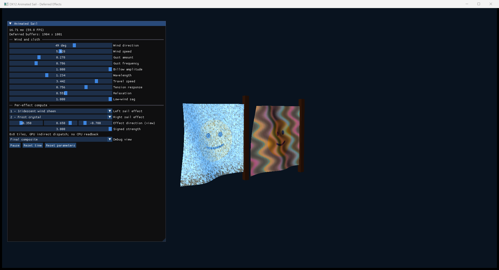
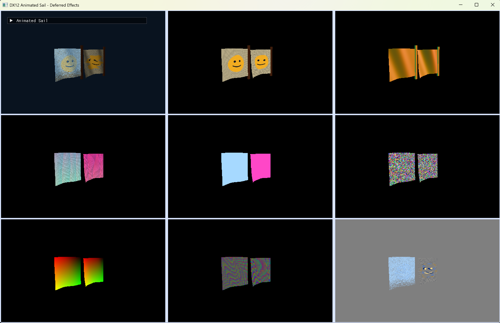
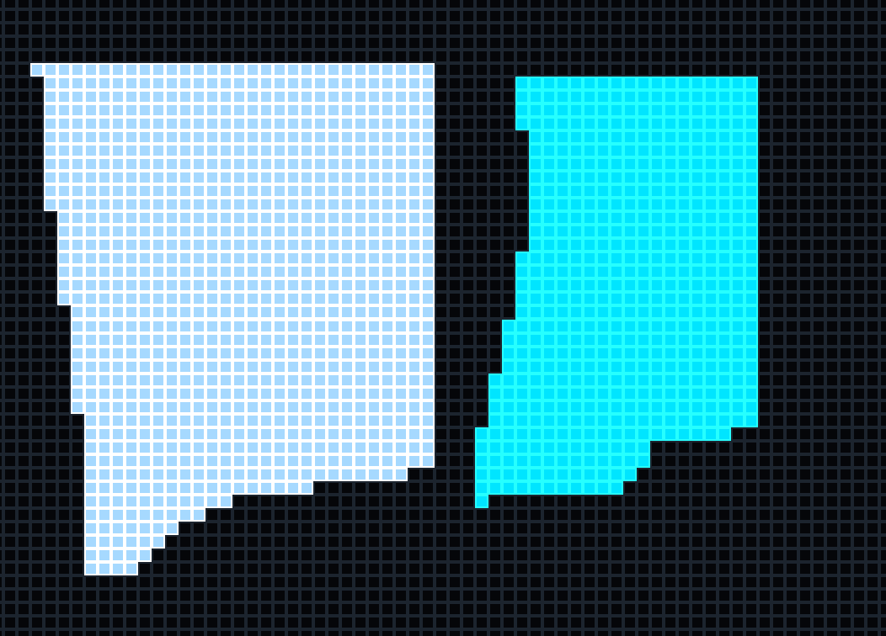

# VBuffer Animated Flag

A DirectX 12 experiment that uses a compact visibility buffer to route deferred screen-space effects without putting effect logic in material shaders.



## Core technique

1. **G-buffer rasterization**
   - `SailVS` deforms two instanced flags entirely on the GPU.
   - The material pixel shader writes only base albedo, encoded view-space normal/material, depth, and effects V-buffer data.
2. **Effect tile classification**
   - Compute shaders scan 8x8 screen tiles for each non-zero effect ID.
   - Matching tiles are appended to per-effect GPU lists and converted into indirect dispatch arguments without CPU readback.
3. **Per-effect compute**
   - Each effect has its own compute PSO and processes only its classified tiles through `ExecuteIndirect`.
   - Effects write to a signed-delta texture rather than modifying the G-buffer in place.
4. **Deferred composition**
   - The final pass lights the G-buffer and adds the signed effect delta.

```text
final color = shaded G-buffer color + signed effect delta
```

This supports both:

- **Additive effects**, which contribute positive or negative color changes.
- **Effective overrides**, which write `desired result - original result`. The warp effect uses this to fully replace the original smiley sample at strength `1`.

## Buffer layout

| Buffer | Format | Contents |
|---|---|---|
| Albedo | `R8G8B8A8_UNORM` | Procedural cloth and smiley material |
| Normal/material | `R16G16B16A16_FLOAT` | Encoded view-space normal and material ID |
| Effects V-buffer | `R32G32B32A32_UINT` | Effect ID, primitive ID, packed logical UV, packed barycentrics |
| Depth | `R32_TYPELESS` | Depth testing and deferred sampling |
| Signed delta | `R16G16B16A16_FLOAT` | Additive or replacement-equivalent effect output |

Barycentrics are reconstructed from logical flag UV, primitive ID, and the known regular grid because the sample retains the `D3DCompile` shader model 5.1 path.

## Included effects

- Iridescent wind sheen
- Frost crystal growth
- Storm-lightning veins
- Smiley warp distortion

Each flag selects its effect independently through ImGui. The panel also controls wind, gusts, billowing, tension, sag, effect direction, strength, and debug views.

## Debug views

The renderer exposes individual G-buffer and V-buffer channels, signed deltas, classified dispatch tiles, and a combined overview.



The overview tiles are ordered left-to-right, top-to-bottom:

| Row | Left | Center | Right |
|---|---|---|---|
| Top | Final deferred composite | Base albedo G-buffer | Encoded view-space normal/material |
| Middle | Combined V-buffer data | Effect ID | Primitive ID |
| Bottom | Logical flag UV | Reconstructed barycentrics | Signed effect delta |

- **Combined V-buffer data** blends the selected effect color with UV, primitive, and barycentric variation.
- **Effect ID** assigns a stable color to each compute effect.
- **Primitive ID** hashes each rasterized triangle to a unique debug color.
- **Logical UV** maps U and V to red and green.
- **Barycentrics** maps the three triangle coordinates to RGB.
- **Signed delta** is centered at gray: brighter values are positive contributions and darker values are negative contributions.



## Build

Requires Windows 10/11, CMake 3.24+, and Visual Studio 2022 with Desktop development with C++. CMake fetches pinned Dear ImGui `v1.91.8`.

```powershell
cmake -S . -B build -G "Visual Studio 17 2022" -A x64
cmake --build build --config Release
.\build\Release\VBufferAnimatedSail.exe
```
